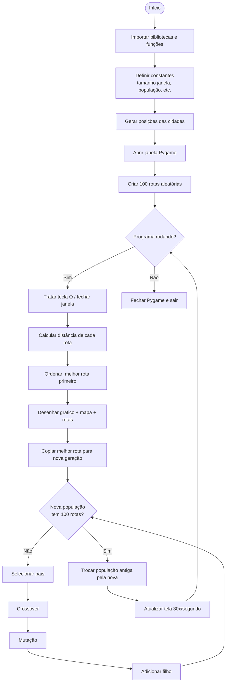
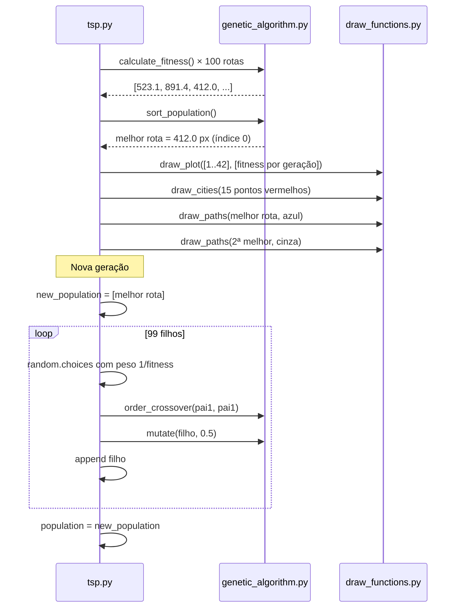

# Guia completo — TSP com Algoritmo Genético

Este documento explica o projeto **do zero**, para qualquer pessoa entender o que o programa faz, como as peças se conectam e onde encontrar cada trecho no código.

> **Como usar os links:** cada explicação traz um link como [`tsp.py`, linha 26](tsp.py#L26).  
> No Cursor/VS Code, **Ctrl + clique** (ou clique simples, dependendo da configuração) abre o arquivo na linha indicada.

---

## Índice

1. [O que este programa faz?](#1-o-que-este-programa-faz)
2. [Conceitos básicos (sem jargão)](#2-conceitos-básicos-sem-jargão)
3. [Como executar](#3-como-executar)
4. [Arquivos do projeto](#4-arquivos-do-projeto)
5. [Fluxo geral do programa](#5-fluxo-geral-do-programa)
6. [Tela: o que você vê ao rodar](#6-tela-o-que-você-vê-ao-rodar)
7. [Explicação arquivo por arquivo](#7-explicação-arquivo-por-arquivo)
   - [tsp.py — o maestro](#71-tsppy--o-maestro)
   - [genetic_algorithm.py — o cérebro do GA](#72-genetic_algorithmpy--o-cérebro-do-ga)
   - [draw_functions.py — o desenho na tela](#73-draw_functionspy--o-desenho-na-tela)
8. [Uma geração passo a passo](#8-uma-geração-passo-a-passo)
9. [Parâmetros que você pode mudar](#9-parâmetros-que-você-pode-mudar)
10. [Perguntas frequentes](#10-perguntas-frequentes)

---

## 1. O que este programa faz?

Imagine um entregador que precisa visitar **15 cidades** espalhadas no mapa, **passar em cada uma só uma vez** e **voltar ao ponto de partida**, gastando o **menor caminho possível**.

Isso é o **Problema do Caixeiro Viajante** (TSP — *Traveling Salesman Problem*).

Em vez de testar todas as rotas possíveis (número gigantesco), o programa usa um **Algoritmo Genético (GA)**: imita a evolução biológica — gera muitas rotas, avalia quais são melhores, combina as boas, aplica pequenas mutações e repete por muitas **gerações** até a rota melhorar.

O diferencial deste projeto: tudo acontece **ao vivo na tela**, com Pygame mostrando o mapa e um gráfico de evolução.

---

## 2. Conceitos básicos (sem jargão)

| Termo | Significado simples | Onde ver no código |
|-------|---------------------|-------------------|
| **Cidade** | Um ponto `(x, y)` na tela | [`tsp.py`, linhas 53–54](tsp.py#L53-L54) |
| **Rota / indivíduo** | Ordem de visita às cidades (ex.: A → C → B → A) | [`genetic_algorithm.py`, linha 27](genetic_algorithm.py#L27) |
| **População** | Conjunto de rotas (100 rotas ao mesmo tempo) | [`tsp.py`, linha 99](tsp.py#L99) |
| **Fitness** | “Nota” da rota = distância total em pixels. **Menor = melhor** | [`genetic_algorithm.py`, linhas 44–60](genetic_algorithm.py#L44-L60) |
| **Geração** | Uma rodada completa: avaliar → ordenar → criar filhos → repetir | [`tsp.py`, linhas 110–197](tsp.py#L110-L197) |
| **Seleção** | Escolher rotas “pais” para gerar filhos | [`tsp.py`, linhas 177–178](tsp.py#L177-L178) |
| **Crossover** | Misturar dois pais para criar um filho | [`genetic_algorithm.py`, linhas 63–90](genetic_algorithm.py#L63-L90) |
| **Mutação** | Pequena alteração aleatória no filho | [`genetic_algorithm.py`, linhas 120–146](genetic_algorithm.py#L120-L146) |
| **Elitismo** | O melhor da geração passa intacto para a próxima | [`tsp.py`, linha 166](tsp.py#L166) |

---

## 3. Como executar

**Pré-requisitos:** Python 3, Pygame, Matplotlib, NumPy.

```bash
pip install pygame matplotlib numpy
python tsp.py
```

**Controles durante a execução:**

| Ação | Efeito | Código |
|------|--------|--------|
| Fechar a janela (X) | Encerra o programa | [`tsp.py`, linhas 113–114](tsp.py#L113-L114) |
| Tecla **Q** | Encerra o programa | [`tsp.py`, linhas 115–117](tsp.py#L115-L117) |

---

## 4. Arquivos do projeto

```
genetic_algorithm_tsp-main/
├── tsp.py                  ← programa principal (janela + loop)
├── genetic_algorithm.py    ← fitness, crossover, mutação, população
├── draw_functions.py       ← desenho do gráfico e do mapa
├── benchmark_att48.py      ← dados do benchmark ATT48 (opcional)
├── demo_crossover.py       ← demonstração isolada do crossover
├── demo_mutation.py        ← demonstração isolada da mutação
└── GUIA.md                 ← este documento
```

| Arquivo | Papel |
|---------|-------|
| [`tsp.py`](tsp.py) | Liga tudo: cria cidades, roda o GA em loop, desenha na tela |
| [`genetic_algorithm.py`](genetic_algorithm.py) | Funções matemáticas e genéticas reutilizáveis |
| [`draw_functions.py`](draw_functions.py) | Converte dados em pixels na janela |

---

## 5. Fluxo geral do programa



**Resumo em uma frase:** o programa cria rotas aleatórias, mede quão longas são, guarda a melhor, gera novas rotas a partir das boas, e repete — mostrando tudo na tela.

---

## 6. Tela: o que você vê ao rodar

A janela tem **800 × 400 pixels**, dividida em duas áreas:

```
┌─────────────────────────┬──────────────────────────────┐
│                         │                              │
│   GRÁFICO (esquerda)    │   MAPA (direita)             │
│   Eixo X: geração       │   ● cidades vermelhas        │
│   Eixo Y: melhor        │   ━ rota azul = melhor       │
│       distância         │   ─ rota cinza = 2ª melhor   │
│                         │                              │
│   ~0 até x=450          │   x=450 até x=800            │
└─────────────────────────┴──────────────────────────────┘
```

| Elemento visual | Significado | Código |
|-----------------|-------------|--------|
| Gráfico decrescente | A melhor rota está ficando mais curta ao longo do tempo | [`tsp.py`, linhas 150–151](tsp.py#L150-L151) → [`draw_functions.py`, linhas 29–41](draw_functions.py#L29-L41) |
| Círculos vermelhos | Posição fixa de cada cidade | [`tsp.py`, linha 154](tsp.py#L154) → [`draw_functions.py`, linhas 56–57](draw_functions.py#L56-L57) |
| Linha azul grossa | Melhor rota encontrada até agora | [`tsp.py`, linha 155](tsp.py#L155) |
| Linha cinza fina | Segunda melhor rota (referência visual) | [`tsp.py`, linha 156](tsp.py#L156) |

O deslocamento `PLOT_X_OFFSET = 450` existe para as cidades **não ficarem em cima do gráfico**: [`tsp.py`, linha 29](tsp.py#L29).

---

## 7. Explicação arquivo por arquivo

### 7.1 `tsp.py` — o maestro

Este é o arquivo que você executa. Ele não implementa a genética em si — **importa** funções prontas e coordena o loop visual.

#### Cabeçalho e imports

O comentário no topo resume o objetivo do arquivo: resolver TSP com GA, onde cada indivíduo é uma rota.  
→ [`tsp.py`, linhas 1–6](tsp.py#L1-L6)

| Import | Para quê |
|--------|----------|
| `pygame` | Janela gráfica, eventos, desenho | [`tsp.py`, linha 8](tsp.py#L8) |
| `random` | Cidades aleatórias e sorteio de pais | [`tsp.py`, linha 10](tsp.py#L10) |
| `itertools.count` | Contador automático de gerações (1, 2, 3…) | [`tsp.py`, linha 11](tsp.py#L11) |
| Funções de `genetic_algorithm` | Fitness, crossover, mutação, etc. | [`tsp.py`, linha 12](tsp.py#L12) |
| Funções de `draw_functions` | Plot, cidades, caminhos | [`tsp.py`, linha 13](tsp.py#L13) |
| `numpy` | Cálculo dos pesos na seleção (`1/fitness`) | [`tsp.py`, linha 15](tsp.py#L15) |
| `benchmark_att48` | Dados opcionais do benchmark (modo comentado) | [`tsp.py`, linha 17](tsp.py#L17) |

#### Constantes da janela

| Constante | Valor | Por quê |
|-----------|-------|---------|
| `WIDTH, HEIGHT` | 800, 400 | Tamanho da janela | [`tsp.py`, linha 26](tsp.py#L26) |
| `NODE_RADIUS` | 10 | Tamanho do círculo de cada cidade | [`tsp.py`, linha 27](tsp.py#L27) |
| `FPS` | 30 | Limita velocidade do loop (suavidade vs. CPU) | [`tsp.py`, linha 28](tsp.py#L28) |
| `PLOT_X_OFFSET` | 450 | Separa área do gráfico da área do mapa | [`tsp.py`, linha 29](tsp.py#L29) |

#### Constantes do algoritmo genético

| Constante | Valor | Por quê |
|-----------|-------|---------|
| `N_CITIES` | 15 | Quantas cidades existem no problema | [`tsp.py`, linha 32](tsp.py#L32) |
| `POPULATION_SIZE` | 100 | Quantas rotas competem por geração | [`tsp.py`, linha 33](tsp.py#L33) |
| `N_GENERATIONS` | `None` | Reservado; o loop atual não usa limite fixo | [`tsp.py`, linha 34](tsp.py#L34) |
| `MUTATION_PROBABILITY` | 0.5 | 50% de chance de mutar cada filho | [`tsp.py`, linha 35](tsp.py#L35) |

#### Cores

Tuplas RGB para fundo branco, cidades vermelhas e rota azul.  
→ [`tsp.py`, linhas 37–41](tsp.py#L37-L41)

#### Três formas de definir as cidades

Só **uma** pode estar ativa por vez:

**Modo 1 — Aleatório (ativo):** gera 15 pontos na metade direita da tela.  
→ [`tsp.py`, linhas 53–54](tsp.py#L53-L54)

**Modo 2 — Problemas fixos (comentado):** usa coordenadas pré-definidas pelo autor (5, 10, 12 ou 15 cidades). Bom para testes repetíveis.  
→ [`tsp.py`, linhas 57–60](tsp.py#L57-L60) e [`genetic_algorithm.py`, linhas 8–13](genetic_algorithm.py#L8-L13)

**Modo 3 — Benchmark ATT48 (comentado):** 48 cidades reais, redimensionadas para caber na janela. Permite comparar com a solução ótima conhecida.  
→ [`tsp.py`, linhas 63–77](tsp.py#L63-L77)

#### Inicialização do Pygame

Abre a janela, define título e cria o relógio que controla FPS.  
→ [`tsp.py`, linhas 84–87](tsp.py#L84-L87)

O contador `generation_counter` evita gerenciar manualmente `generation += 1`.  
→ [`tsp.py`, linha 90](tsp.py#L90)

#### População inicial e histórico

- `generate_random_population` cria 100 permutações aleatórias das mesmas cidades.  
  → [`tsp.py`, linha 99](tsp.py#L99)
- `best_fitness_values` guarda a melhor distância a cada geração (para o gráfico).  
  → [`tsp.py`, linha 102](tsp.py#L102)
- `best_solutions` guarda a melhor rota a cada geração (para uso futuro / TODO).  
  → [`tsp.py`, linha 103](tsp.py#L103)

#### Loop principal

O coração do programa. Cada volta do `while running` é **uma geração**.

| Etapa | O que faz | Link |
|-------|-----------|------|
| Eventos | Detecta fechar janela ou tecla Q | [`tsp.py`, linhas 112–117](tsp.py#L112-L117) |
| Contador | Avança número da geração | [`tsp.py`, linha 119](tsp.py#L119) |
| Limpar tela | Fundo branco antes de redesenhar | [`tsp.py`, linha 122](tsp.py#L122) |
| Avaliação | Distância de cada rota | [`tsp.py`, linhas 129–130](tsp.py#L129-L130) |
| Ordenação | Melhor rota vai para índice 0 | [`tsp.py`, linhas 136–137](tsp.py#L136-L137) |
| Melhor da geração | Extrai fitness e rota campeã | [`tsp.py`, linhas 139–140](tsp.py#L139-L140) |
| Histórico | Append para o gráfico | [`tsp.py`, linhas 143–144](tsp.py#L143-L144) |
| Visualização | Plot + cidades + rotas | [`tsp.py`, linhas 150–156](tsp.py#L150-L156) |
| Log no terminal | Imprime geração e fitness | [`tsp.py`, linha 158](tsp.py#L158) |
| Elitismo | Copia campeão para nova população | [`tsp.py`, linha 166](tsp.py#L166) |
| Reprodução | Loop até completar 100 indivíduos | [`tsp.py`, linhas 168–190](tsp.py#L168-L190) |
| Nova população | Substitui a antiga | [`tsp.py`, linha 193](tsp.py#L193) |
| Atualizar tela | `flip` + `tick(FPS)` | [`tsp.py`, linhas 196–197](tsp.py#L196-L197) |

#### Encerramento

Libera recursos do Pygame e fecha o processo.  
→ [`tsp.py`, linhas 203–204](tsp.py#L203-L204)

---

### 7.2 `genetic_algorithm.py` — o cérebro do GA

Contém a lógica reutilizável, sem interface gráfica. Pode ser testada sozinha (bloco `if __name__ == '__main__'` no final).

#### Problemas padrão

Dicionário com instâncias fixas de 5, 10, 12 e 15 cidades.  
→ [`genetic_algorithm.py`, linhas 8–13](genetic_algorithm.py#L8-L13)

#### `generate_random_population`

**O que faz:** para cada indivíduo, embaralha a lista de cidades com `random.sample` (sem repetir cidade).

**Por quê assim:** `random.sample` garante que cada rota visita **todas** as cidades **uma vez** — requisito do TSP.

→ [`genetic_algorithm.py`, linhas 15–27](genetic_algorithm.py#L15-L27)

#### `calculate_distance`

Distância euclidiana entre dois pontos: \(\sqrt{(x_2-x_1)^2 + (y_2-y_1)^2}\).

→ [`genetic_algorithm.py`, linhas 30–41](genetic_algorithm.py#L30-L41)

#### `calculate_fitness`

**O que faz:** soma a distância de cada trecho da rota, incluindo o retorno da última cidade à primeira (`% n`).

**Por quê `% n`:** no TSP o caixeiro **fecha o ciclo** — a última cidade conecta de volta à primeira.

→ [`genetic_algorithm.py`, linhas 44–60](genetic_algorithm.py#L44-L60)

**Exemplo numérico:** se a rota passa por 3 cidades A→B→C, o fitness soma: dist(A,B) + dist(B,C) + dist(C,A).

#### `order_crossover` (OX)

**O que faz:** pega um pedaço contíguo do pai 1 e preenche o resto com cidades do pai 2 na ordem em que aparecem, sem repetir.

**Por quê OX e não “cortar e colar” simples:** no TSP, trocar pedaços ao acaso cria rotas **inválidas** (cidade duplicada ou faltando). O Order Crossover foi criado especificamente para permutações.

Passos no código:

1. Escolhe índices aleatórios de corte → [`genetic_algorithm.py`, linhas 77–78](genetic_algorithm.py#L77-L78)
2. Copia segmento do pai 1 → [`genetic_algorithm.py`, linha 81](genetic_algorithm.py#L81)
3. Preenche posições restantes com genes do pai 2 → [`genetic_algorithm.py`, linhas 84–88](genetic_algorithm.py#L84-L88)

→ Função completa: [`genetic_algorithm.py`, linhas 63–90](genetic_algorithm.py#L63-L90)

#### `mutate`

**O que faz:** com probabilidade `mutation_probability`, troca duas cidades **vizinhas** de lugar.

**Por quê:** pequenas perturbações exploram rotas novas sem destruir a estrutura inteira. Sem mutação, a população pode convergir cedo demais para soluções mediocres.

Detalhes:

- Cópia profunda para não alterar o original → [`genetic_algorithm.py`, linha 131](genetic_algorithm.py#L131)
- Sorteio `random.random() < mutation_probability` → [`genetic_algorithm.py`, linha 134](genetic_algorithm.py#L134)
- Troca de índice `i` com `i+1` → [`genetic_algorithm.py`, linhas 141–144](genetic_algorithm.py#L141-L144)

→ Função completa: [`genetic_algorithm.py`, linhas 120–146](genetic_algorithm.py#L120-L146)

#### `sort_population`

**O que faz:** emparelha cada rota com seu fitness, ordena do **menor** fitness ao maior, devolve listas ordenadas.

**Por quê:** precisamos saber quem é o campeão (`population[0]`) antes de selecionar pais e aplicar elitismo.

→ [`genetic_algorithm.py`, linhas 158–178](genetic_algorithm.py#L158-L178)

#### Modo console (sem Pygame)

Se executar `python genetic_algorithm.py` diretamente, roda 100 gerações no terminal, com seleção dos top 10 e crossover entre dois pais distintos.  
→ [`genetic_algorithm.py`, linhas 181–229](genetic_algorithm.py#L181-L229)

> **Diferença importante:** no modo console usa [`order_crossover(parent1, parent2)`](genetic_algorithm.py#L220), enquanto `tsp.py` atualmente usa [`order_crossover(parent1, parent1)`](tsp.py#L184) — ver FAQ.

---

### 7.3 `draw_functions.py` — o desenho na tela

#### Backend Matplotlib “Agg”

`matplotlib.use("Agg")` renderiza gráficos **sem abrir janela própria** — a imagem é copiada para a superfície Pygame.  
→ [`draw_functions.py`, linha 15](draw_functions.py#L15)

#### `draw_plot`

Pipeline:

1. Cria figura Matplotlib com os dados de convergência → [`draw_functions.py`, linhas 29–33](draw_functions.py#L29-L33)
2. Renderiza em buffer de pixels → [`draw_functions.py`, linhas 35–38](draw_functions.py#L35-L38)
3. Converte para superfície Pygame e desenha no canto superior esquerdo → [`draw_functions.py`, linhas 39–40](draw_functions.py#L39-L40)
4. Fecha a figura (evita vazamento de memória a cada geração) → [`draw_functions.py`, linha 41](draw_functions.py#L41)

#### `draw_cities`

Desenha um círculo vermelho (ou cor passada) em cada coordenada de cidade.  
→ [`draw_functions.py`, linhas 43–57](draw_functions.py#L43-L57)

#### `draw_paths`

Desenha linhas conectando as cidades na ordem da rota. O parâmetro `True` fecha o polígono (última cidade → primeira).  
→ [`draw_functions.py`, linhas 61–71](draw_functions.py#L61-L71)

#### `draw_text`

Função auxiliar para texto na tela — **não é usada** em `tsp.py` no momento e contém referências incompletas (`np`, `HEIGHT`). Pode ser ignorada ou corrigida no futuro.  
→ [`draw_functions.py`, linhas 74–92](draw_functions.py#L74-L92)

---

## 8. Uma geração passo a passo

Exemplo concreto do que acontece na **Geração 42**:



| Passo | Entrada | Saída |
|-------|---------|-------|
| 1. Fitness | 100 rotas | 100 distâncias |
| 2. Ordenar | rotas + distâncias | melhor em `[0]` |
| 3. Desenhar | melhor rota + histórico | pixels na tela |
| 4. Elitismo | campeão | 1º slot da nova população |
| 5. Seleção | população ordenada | 2 pais (sorteados) |
| 6. Crossover | 2 pais | 1 filho |
| 7. Mutação | filho | filho possivelmente alterado |
| 8. Repetir 5–7 | — | até 100 indivíduos |

---

## 9. Parâmetros que você pode mudar

| Parâmetro | Efeito se aumentar | Efeito se diminuir | Onde mudar |
|-----------|-------------------|-------------------|------------|
| `N_CITIES` | Problema mais difícil, mais linhas no mapa | Mais fácil, converge rápido | [`tsp.py`, linha 32](tsp.py#L32) |
| `POPULATION_SIZE` | Mais diversidade, mais lento | Mais rápido, pode estagnar | [`tsp.py`, linha 33](tsp.py#L33) |
| `MUTATION_PROBABILITY` | Mais exploração aleatória | População mais “conservadora” | [`tsp.py`, linha 35](tsp.py#L35) |
| `FPS` | Animação mais rápida (mais CPU) | Animação mais lenta | [`tsp.py`, linha 28](tsp.py#L28) |
| `WIDTH / HEIGHT` | Janela maior | Janela menor | [`tsp.py`, linha 26](tsp.py#L26) |

---

## 10. Perguntas frequentes

### Por que o fitness é a distância e não “1/distância”?

Por simplicidade: `calculate_fitness` retorna distância bruta. Na **seleção**, o código inverte (`1/fitness`) para rotas curtas terem mais chance.  
→ Cálculo: [`genetic_algorithm.py`, linha 60](genetic_algorithm.py#L60)  
→ Inversão na seleção: [`tsp.py`, linha 177](tsp.py#L177)

### O que é elitismo e por que importa?

Sem elitismo, um filho ruim poderia substituir acidentalmente o melhor indivíduo. Copiar o campeão garante que o recorde **nunca piora** entre gerações.  
→ [`tsp.py`, linha 166](tsp.py#L166)

### Por que `order_crossover(parent1, parent1)` em tsp.py?

A linha comentada [`order_crossover(parent1, parent2)`](tsp.py#L183) usa **dois pais diferentes** — comportamento clássico do GA. A linha ativa [`order_crossover(parent1, parent1)`](tsp.py#L184) usa o mesmo pai duas vezes, então o crossover quase não mistura genes; a evolução depende quase só da **mutação** e da **seleção**. Para evolução mais rica, descomente a linha 183 e comente a 184.

### O gráfico deveria descer?

Sim, em geral. Significa que a melhor distância está **diminuindo** — o algoritmo está encontrando rotas melhores. Se estabilizar, a população convergiu (não necessariamente ao ótimo global).

### Posso rodar sem interface gráfica?

Sim. Execute `python genetic_algorithm.py` — roda 100 gerações no terminal.  
→ [`genetic_algorithm.py`, linhas 181–229](genetic_algorithm.py#L181-L229)

### Quais dependências faltam no README original?

O README menciona só Pygame, mas `tsp.py` também usa **Matplotlib** (gráfico) e **NumPy** (pesos da seleção).  
→ Imports: [`tsp.py`, linhas 12–15](tsp.py#L12-L15)

---

## Referência rápida — mapa de links

### `tsp.py`

| Linhas | Conteúdo |
|--------|----------|
| [1–6](tsp.py#L1-L6) | Descrição do arquivo |
| [26–35](tsp.py#L26-L35) | Constantes |
| [53–54](tsp.py#L53-L54) | Cidades aleatórias |
| [84–90](tsp.py#L84-L90) | Init Pygame |
| [99–103](tsp.py#L99-L103) | População inicial |
| [110–197](tsp.py#L110-L197) | Loop principal |
| [203–204](tsp.py#L203-L204) | Encerramento |

### `genetic_algorithm.py`

| Linhas | Conteúdo |
|--------|----------|
| [15–27](genetic_algorithm.py#L15-L27) | População aleatória |
| [30–41](genetic_algorithm.py#L30-L41) | Distância euclidiana |
| [44–60](genetic_algorithm.py#L44-L60) | Fitness |
| [63–90](genetic_algorithm.py#L63-L90) | Crossover OX |
| [120–146](genetic_algorithm.py#L120-L146) | Mutação |
| [158–178](genetic_algorithm.py#L158-L178) | Ordenação |

### `draw_functions.py`

| Linhas | Conteúdo |
|--------|----------|
| [18–41](draw_functions.py#L18-L41) | Gráfico de convergência |
| [43–57](draw_functions.py#L43-L57) | Desenho das cidades |
| [61–71](draw_functions.py#L61-L71) | Desenho das rotas |

---

*Documento gerado para o projeto TSP + Algoritmo Genético. Para dúvidas sobre execução, comece por [`tsp.py`, linha 1](tsp.py#L1) e siga o [fluxo geral](#5-fluxo-geral-do-programa).*
