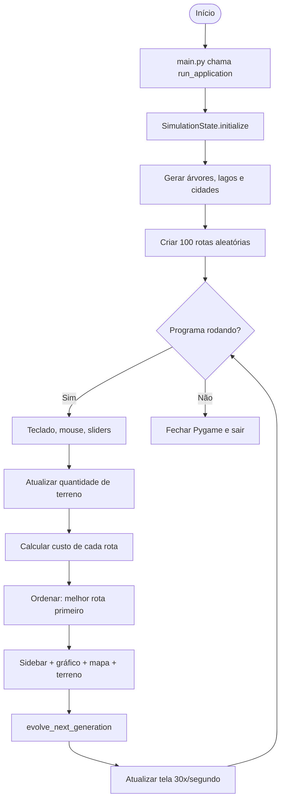
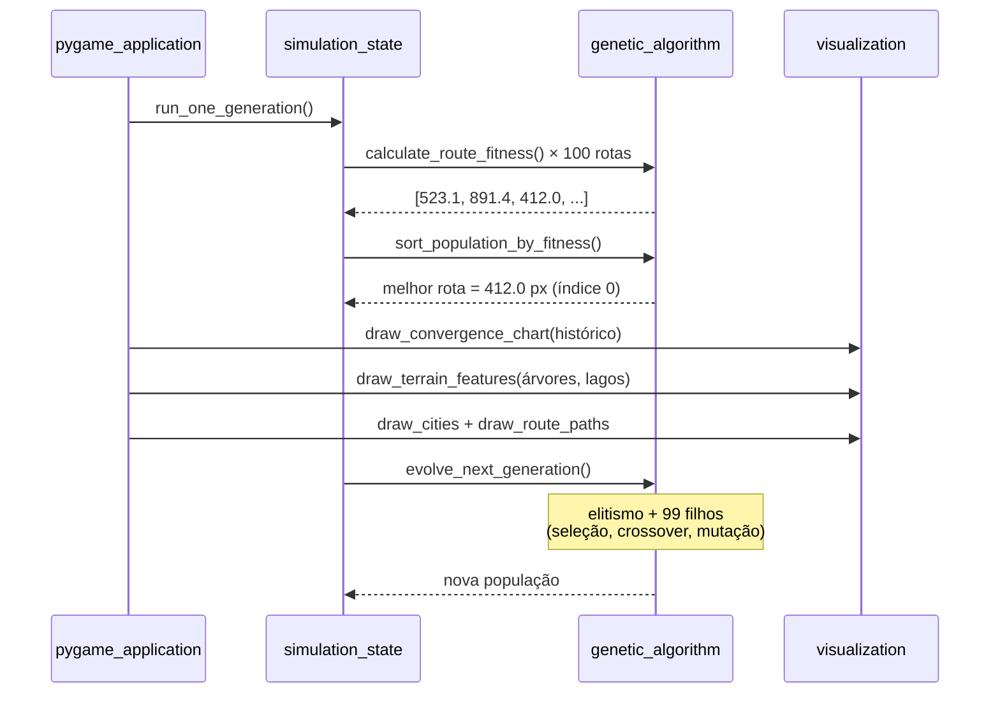

# Guia completo — TSP com Algoritmo Genético

Este documento explica o projeto **do zero**, para qualquer pessoa entender o que o programa faz, como as peças se conectam e onde encontrar cada trecho no código.

> **Como usar os links:** cada explicação traz um link como [`main.py`, linha 5](main.py#L5).  
> No Cursor/VS Code, **Ctrl + clique** (ou clique simples, dependendo da configuração) abre o arquivo na linha indicada.

---

## Índice

1. [O que este programa faz?](#1-o-que-este-programa-faz)
2. [Conceitos básicos (sem jargão)](#2-conceitos-básicos-sem-jargão)
3. [Como executar](#3-como-executar)
4. [Estrutura do projeto](#4-estrutura-do-projeto)
5. [Fluxo geral do programa](#5-fluxo-geral-do-programa)
6. [Tela: o que você vê ao rodar](#6-tela-o-que-você-vê-ao-rodar)
7. [Explicação módulo por módulo](#7-explicação-módulo-por-módulo)
   - [main.py — ponto de entrada](#71-mainpy--ponto-de-entrada)
   - [simulation/ — loop e estado](#72-simulation--loop-e-estado)
   - [genetic_algorithm/ — o cérebro do GA](#73-genetic_algorithm--o-cérebro-do-ga)
   - [obstacles/ — árvores e lagos](#74-obstacles--árvores-e-lagos)
   - [visualization/ — interface e desenho](#75-visualization--interface-e-desenho)
8. [Uma geração passo a passo](#8-uma-geração-passo-a-passo)
9. [Parâmetros que você pode mudar](#9-parâmetros-que-você-pode-mudar)
10. [Perguntas frequentes](#10-perguntas-frequentes)

---

## 1. O que este programa faz?

Imagine um entregador que precisa visitar **15 cidades** espalhadas no mapa, **passar em cada uma só uma vez** e **voltar ao ponto de partida**, gastando o **menor caminho possível**.

Isso é o **Problema do Caixeiro Viajante** (TSP — *Traveling Salesman Problem*).

Em vez de testar todas as rotas possíveis (número gigantesco), o programa usa um **Algoritmo Genético (GA)**: imita a evolução biológica — gera muitas rotas, avalia quais são melhores, combina as boas, aplica pequenas mutações e repete por muitas **gerações** até a rota melhorar.

O diferencial deste projeto:

- Tudo acontece **ao vivo na tela**, com Pygame mostrando o mapa e um gráfico de convergência.
- O mapa possui **árvores** e **lagos** desenhados proceduralmente.
- Você controla quantos elementos existem, se aparecem no mapa e se o algoritmo deve **evitá-los** (penalidade no fitness).

---

## 2. Conceitos básicos (sem jargão)

| Termo | Significado simples | Onde ver no código |
|-------|---------------------|-------------------|
| **Cidade** | Um ponto `(x, y)` na tela | [`problem/city_generator.py`](traveling_salesman_problem/problem/city_generator.py) |
| **Rota / indivíduo** | Ordem de visita às cidades (ex.: A → C → B → A) | [`genetic_algorithm/population.py`](traveling_salesman_problem/genetic_algorithm/population.py) |
| **População** | Conjunto de rotas (100 rotas ao mesmo tempo) | [`config/application_settings.py`, linha 15](traveling_salesman_problem/config/application_settings.py#L15) |
| **Fitness / custo** | “Nota” da rota = distância total + penalidades. **Menor = melhor** | [`genetic_algorithm/fitness.py`](traveling_salesman_problem/genetic_algorithm/fitness.py) |
| **Geração** | Uma rodada completa: avaliar → ordenar → criar filhos → repetir | [`simulation/simulation_state.py`, `run_one_generation`](traveling_salesman_problem/simulation/simulation_state.py) |
| **Seleção** | Escolher rotas “pais” para gerar filhos | [`genetic_algorithm/selection.py`](traveling_salesman_problem/genetic_algorithm/selection.py) |
| **Crossover** | Misturar dois pais para criar um filho | [`genetic_algorithm/crossover.py`](traveling_salesman_problem/genetic_algorithm/crossover.py) |
| **Mutação** | Pequena alteração aleatória no filho | [`genetic_algorithm/mutation.py`](traveling_salesman_problem/genetic_algorithm/mutation.py) |
| **Elitismo** | O melhor da geração passa intacto para a próxima | [`genetic_algorithm/selection.py`, linha 45](traveling_salesman_problem/genetic_algorithm/selection.py#L45) |
| **Árvore** | Elemento circular no mapa; rota que a cruza pode receber penalidade | [`obstacles/models.py`, `TreeObstacle`](traveling_salesman_problem/obstacles/models.py) |
| **Lago** | Elemento elíptico no mapa; rota que o cruza pode receber penalidade | [`obstacles/models.py`, `LakeObstacle`](traveling_salesman_problem/obstacles/models.py) |

---

## 3. Como executar

**Pré-requisitos:** Python 3.9+, Pygame, Matplotlib, NumPy.

```bash
pip install -r requirements.txt
python main.py
```

**Controles durante a execução:**

| Ação | Efeito | Código |
|------|--------|--------|
| Fechar a janela (X) | Encerra o programa | [`pygame_application.py`, linhas 41–42](traveling_salesman_problem/simulation/pygame_application.py#L41-L42) |
| Tecla **Q** ou **Esc** | Encerra o programa | [`pygame_application.py`, linhas 44–45](traveling_salesman_problem/simulation/pygame_application.py#L44-L45) |
| Tecla **O** | Alterna penalidades de árvores e lagos | [`simulation_state.py`, linhas 207–209](traveling_salesman_problem/simulation/simulation_state.py#L207-L209) |
| Slider de mutação | Ajusta taxa de mutação ao vivo | [`widgets/mutation_slider.py`](traveling_salesman_problem/visualization/widgets/mutation_slider.py) |
| Sliders Árvores / Lagos | Altera quantidade no mapa | [`simulation_state.py`, linhas 122–141](traveling_salesman_problem/simulation/simulation_state.py#L122-L141) |
| Botão **Sortear posições** | Reposiciona árvores, lagos e cidades | [`simulation_state.py`, `shuffle_terrain_and_cities`](traveling_salesman_problem/simulation/simulation_state.py) |

**Demonstrações isoladas (sem interface gráfica):**

```bash
python -m demos.demonstrate_crossover
python -m demos.demonstrate_mutation
```

---

## 4. Estrutura do projeto

```
genetic_algorithm_tsp-main/
├── main.py
├── requirements.txt
├── GUIA.md
├── README.md
│
├── traveling_salesman_problem/
│   ├── config/
│   │   ├── application_settings.py   ← parâmetros da janela e do algoritmo
│   │   └── visual_theme.py           ← cores, fontes, medidas da interface
│   │
│   ├── genetic_algorithm/
│   │   ├── population.py             ← criar e ordenar população
│   │   ├── fitness.py                ← distância e custo da rota
│   │   ├── crossover.py              ← Order Crossover (OX)
│   │   ├── mutation.py               ← troca de cidades adjacentes
│   │   ├── selection.py              ← seleção de pais e nova geração
│   │   └── predefined_problems.py    ← instâncias fixas (5, 10, 12, 15 cidades)
│   │
│   ├── obstacles/
│   │   ├── models.py                 ← TreeObstacle, LakeObstacle
│   │   ├── placement.py              ← gerar, sincronizar e sortear posições
│   │   ├── collision.py              ← ponto e segmento vs. terreno
│   │   └── penalty.py                ← penalidade por cruzamento
│   │
│   ├── problem/
│   │   ├── city_generator.py         ← cidades aleatórias válidas
│   │   └── att48_benchmark.py        ← benchmark ATT48 (opcional)
│   │
│   ├── visualization/
│   │   ├── application_layout.py     ← sidebar, cabeçalhos, legenda
│   │   ├── convergence_chart.py      ← gráfico Matplotlib → Pygame
│   │   ├── map_renderer.py           ← cidades, rotas, terreno
│   │   ├── terrain_drawings.py       ← desenho de árvores e lagos
│   │   └── widgets/                  ← sliders, botões, painel de terreno
│   │
│   └── simulation/
│       ├── simulation_state.py       ← estado mutável e uma geração
│       └── pygame_application.py     ← loop principal Pygame
│
└── demos/
    ├── demonstrate_crossover.py
    └── demonstrate_mutation.py
```

| Módulo | Papel |
|--------|-------|
| [`main.py`](main.py) | Chama `run_application()` e inicia a simulação |
| [`simulation/`](traveling_salesman_problem/simulation/) | Coordena estado, eventos, gerações e desenho |
| [`genetic_algorithm/`](traveling_salesman_problem/genetic_algorithm/) | Funções genéticas reutilizáveis, sem Pygame |
| [`obstacles/`](traveling_salesman_problem/obstacles/) | Árvores, lagos, colisão e penalidades |
| [`visualization/`](traveling_salesman_problem/visualization/) | Tudo que aparece na tela |

---

## 5. Fluxo geral do programa



**Resumo em uma frase:** o programa cria rotas aleatórias, mede quão caras são (distância + penalidades opcionais), guarda a melhor, gera novas rotas a partir das boas, e repete — mostrando tudo na tela com árvores e lagos.

---

## 6. Tela: o que você vê ao rodar

A janela tem **1120 × 940 pixels**, dividida em **sidebar** (esquerda) e **mapa** (direita):

```
┌──────────────────────────┬───────────────────────────────────────┐
│  GRÁFICO DE CONVERGÊNCIA │  Cabeçalho: geração, custo, mutação   │
│  (topo da sidebar)       ├───────────────────────────────────────┤
│                          │                                       │
│  ─── Algoritmo ───       │   🌳 árvores (desenho procedural)     │
│  [Taxa de mutação]       │   💧 lagos (desenho procedural)       │
│                          │   ● cidades vermelhas                 │
│  ─── Terreno no mapa ─── │   ━ rota azul = melhor                │
│  [Árvores] [Lagos]       │   ─ rota cinza = 2ª melhor            │
│                          │                                       │
│  ─── Ações ───           │   fundo verde claro (grama)           │
│  [Sortear posições]      │                                       │
│                          │                                       │
│  ─── Penalidades ───     │                                       │
│  toggles + sliders       │                                       │
│                          │                                       │
│  Q · Sair  O · Penalid.  │                                       │
└──────────────────────────┴───────────────────────────────────────┘
     x = 0 .. 450                x = 450 .. 1120
```

| Elemento visual | Significado | Código |
|-----------------|-------------|--------|
| Gráfico decrescente | A melhor rota está ficando mais barata ao longo do tempo | [`convergence_chart.py`](traveling_salesman_problem/visualization/convergence_chart.py) |
| Círculos vermelhos | Posição de cada cidade | [`map_renderer.py`, `draw_cities`](traveling_salesman_problem/visualization/map_renderer.py) |
| Árvores verdes | Obstáculo circular; tronco + copa em camadas | [`terrain_drawings.py`, `draw_tree`](traveling_salesman_problem/visualization/terrain_drawings.py) |
| Lagos azuis/verdes | Obstáculo elíptico; margem de areia + água | [`terrain_drawings.py`, `draw_lake`](traveling_salesman_problem/visualization/terrain_drawings.py) |
| Linha azul grossa | Melhor rota encontrada até agora | [`pygame_application.py`, linhas 124–129](traveling_salesman_problem/simulation/pygame_application.py#L124-L129) |
| Linha cinza fina | Segunda melhor rota (referência visual) | [`pygame_application.py`, linhas 131–135](traveling_salesman_problem/simulation/pygame_application.py#L131-L135) |

O deslocamento horizontal do mapa (`plot_horizontal_offset = 450`) evita que cidades fiquem sobre a sidebar.  
→ [`config/application_settings.py`, linhas 29–31](traveling_salesman_problem/config/application_settings.py#L29-L31)

---

## 7. Explicação módulo por módulo

### 7.1 `main.py` — ponto de entrada

Arquivo mínimo: importa e executa a simulação.

```python
from traveling_salesman_problem.simulation.pygame_application import run_application

if __name__ == "__main__":
    run_application()
```

→ [`main.py`](main.py)

Toda a lógica está nos pacotes dentro de `traveling_salesman_problem/`.

---

### 7.2 `simulation/` — loop e estado

#### `pygame_application.py` — o maestro visual

Responsável por:

1. Inicializar Pygame e abrir a janela → [linhas 29–32](traveling_salesman_problem/simulation/pygame_application.py#L29-L32)
2. Criar `SimulationState` e chamar `initialize()` → [linhas 34–35](traveling_salesman_problem/simulation/pygame_application.py#L34-L35)
3. Loop principal: eventos → terreno → uma geração → desenho → flip → [linhas 38–141](traveling_salesman_problem/simulation/pygame_application.py#L38-L141)

Cada volta do `while is_running` corresponde a **uma geração** do algoritmo genético.

#### `simulation_state.py` — estado mutável

Centraliza tudo que muda durante a execução:

| Responsabilidade | Método / atributo |
|------------------|-------------------|
| Cidades, população, árvores, lagos | `city_coordinates`, `population`, `terrain_features` |
| Histórico do gráfico | `best_fitness_history`, `best_route_history` |
| Controles da sidebar | `mutation_slider`, `tree_count_slider`, `lake_count_slider`, `terrain_control_panel` |
| Uma geração completa | `run_one_generation()` |
| Sortear posições | `shuffle_terrain_and_cities()` |

Fluxo de `run_one_generation()`:

1. Calcula fitness de todas as rotas (com ou sem penalidades de terreno)
2. Ordena população (menor custo primeiro)
3. Registra melhor rota no histórico
4. Chama `evolve_next_generation()` para produzir a próxima população

→ [`simulation_state.py`, `run_one_generation`](traveling_salesman_problem/simulation/simulation_state.py)

---

### 7.3 `genetic_algorithm/` — o cérebro do GA

Lógica reutilizável, **sem interface gráfica**. Pode ser testada pelos scripts em `demos/`.

#### `population.py`

- **`generate_random_population`** — embaralha cidades com `random.sample` (permutação válida)
- **`sort_population_by_fitness`** — ordena rotas do menor custo ao maior

→ [`population.py`](traveling_salesman_problem/genetic_algorithm/population.py)

#### `fitness.py`

- **`calculate_euclidean_distance`** — distância entre dois pontos
- **`calculate_route_fitness`** — soma distâncias do ciclo fechado (`% n` conecta última cidade à primeira) + penalidades opcionais de terreno

→ [`fitness.py`](traveling_salesman_problem/genetic_algorithm/fitness.py)

#### `crossover.py` — Order Crossover (OX)

Mistura dois pais preservando ordem relativa (válido para TSP). Troca simples de pedaços criaria rotas inválidas (cidade duplicada ou faltando).

→ [`crossover.py`](traveling_salesman_problem/genetic_algorithm/crossover.py)

#### `mutation.py`

Com probabilidade definida, troca duas cidades **vizinhas** de lugar. Explora novas rotas sem destruir toda a estrutura.

→ [`mutation.py`](traveling_salesman_problem/genetic_algorithm/mutation.py)

#### `selection.py`

- **`select_two_parents_by_fitness_weight`** — rotas mais curtas têm peso `1/custo` maior
- **`evolve_next_generation`** — elitismo + seleção + crossover + mutação até completar a população

→ [`selection.py`](traveling_salesman_problem/genetic_algorithm/selection.py)

---

### 7.4 `obstacles/` — árvores e lagos

Apesar do nome da pasta (`obstacles`), o domínio do projeto fala em **terreno**: árvores e lagos.

#### `models.py`

| Classe | Forma no mapa | Colisão |
|--------|---------------|---------|
| `TreeObstacle` | Círculo (centro + raio) | Distância ao centro ≤ raio |
| `LakeObstacle` | Elipse inscrita no retângulo | Equação elíptica normalizada ≤ 1 |

Cada elemento possui `enabled` (visível e ativo) e `penalty` (custo extra se a rota cruzar).

→ [`models.py`](traveling_salesman_problem/obstacles/models.py)

#### `placement.py`

- **`generate_terrain_features_by_type`** — cria N árvores e M lagos em posições aleatórias sem sobreposição
- **`sync_terrain_feature_counts`** — ajusta quantidade quando o slider muda
- **`reshuffle_terrain_feature_positions`** — sorteia novas posições (botão “Sortear posições”)

→ [`placement.py`](traveling_salesman_problem/obstacles/placement.py)

#### `collision.py` e `penalty.py`

- Detectam se um ponto ou segmento de rota intersecta árvore ou lago
- **`calculate_segment_terrain_penalty`** — soma penalidades dos elementos cruzados

→ [`collision.py`](traveling_salesman_problem/obstacles/collision.py), [`penalty.py`](traveling_salesman_problem/obstacles/penalty.py)

---

### 7.5 `visualization/` — interface e desenho

#### `terrain_drawings.py` — desenho procedural

Não usa imagens externas. Desenha com Pygame:

- **Árvore:** sombra, tronco marrom, copa verde em camadas (3 variantes de cor)
- **Lago:** margem de areia, água em tons concêntricos, ondas e brilho (3 variantes)

→ [`terrain_drawings.py`](traveling_salesman_problem/visualization/terrain_drawings.py)

#### `convergence_chart.py`

Usa Matplotlib com backend `Agg` (sem janela própria), renderiza o gráfico em buffer e copia para a superfície Pygame na sidebar.

→ [`convergence_chart.py`](traveling_salesman_problem/visualization/convergence_chart.py)

#### `widgets/`

| Widget | Função |
|--------|--------|
| `MutationSlider` | Taxa de mutação (0–100%) |
| `IntegerSlider` | Quantidade de árvores ou lagos |
| `ActionButton` | Botão “Sortear posições” |
| `TerrainControlPanel` | Toggles e sliders de penalidade por tipo |

→ [`widgets/`](traveling_salesman_problem/visualization/widgets/)

#### `application_layout.py`

Desenha estrutura da janela: sidebar, cabeçalho do mapa, legenda (melhor rota, cidades, árvore, lago).

→ [`application_layout.py`](traveling_salesman_problem/visualization/application_layout.py)

---

## 8. Uma geração passo a passo

Exemplo do que acontece na **Geração 42**:



| Passo | Entrada | Saída |
|-------|---------|-------|
| 1. Fitness | 100 rotas + terreno | 100 custos |
| 2. Ordenar | rotas + custos | melhor em `[0]` |
| 3. Desenhar | melhor rota + histórico | pixels na tela |
| 4. Elitismo | campeão | 1º slot da nova população |
| 5. Seleção | população ordenada | 2 pais (sorteados por peso) |
| 6. Crossover | 2 pais distintos | 1 filho |
| 7. Mutação | filho + taxa do slider | filho possivelmente alterado |
| 8. Repetir 5–7 | — | até 100 indivíduos |

---

## 9. Parâmetros que você pode mudar

Todos ficam em [`config/application_settings.py`](traveling_salesman_problem/config/application_settings.py):

| Parâmetro | Valor padrão | Efeito se aumentar | Efeito se diminuir |
|-----------|--------------|-------------------|-------------------|
| `number_of_cities` | 15 | Problema mais difícil | Converge mais rápido |
| `population_size` | 100 | Mais diversidade, mais lento | Mais rápido, pode estagnar |
| `initial_mutation_probability` | 0.01 (1%) | Mais exploração aleatória | População mais conservadora |
| `initial_tree_count` | 3 | Mais árvores no mapa | Mapa mais vazio |
| `initial_lake_count` | 2 | Mais lagos no mapa | Mapa mais vazio |
| `window_width / window_height` | 1120 / 940 | Janela maior | Janela menor |
| `frames_per_second` | 30 | Animação mais rápida (mais CPU) | Animação mais lenta |

Cores e medidas da interface: [`config/visual_theme.py`](traveling_salesman_problem/config/visual_theme.py).

---

## 10. Perguntas frequentes

### Por que o fitness é distância e não “1/distância”?

Por simplicidade: `calculate_route_fitness` retorna o custo bruto (distância + penalidades). Na **seleção**, o código inverte (`1/custo`) para rotas curtas terem mais chance de ser pai.

→ Cálculo: [`fitness.py`](traveling_salesman_problem/genetic_algorithm/fitness.py)  
→ Inversão: [`selection.py`, linha 24](traveling_salesman_problem/genetic_algorithm/selection.py#L24)

### O que é elitismo e por que importa?

Sem elitismo, um filho ruim poderia substituir acidentalmente o melhor indivíduo. Copiar o campeão garante que o recorde **nunca piora** entre gerações.

→ [`selection.py`, linha 45](traveling_salesman_problem/genetic_algorithm/selection.py#L45)

### Como funcionam as penalidades de árvores e lagos?

Quando o toggle **“Evitar árvores e lagos no algoritmo”** está ativo (ou tecla **O**), cada trecho da rota que cruza um elemento habilitado soma a `penalty` daquele elemento ao custo. Rotas que contornam o terreno são favorecidas.

→ [`penalty.py`](traveling_salesman_problem/obstacles/penalty.py)

### Árvores e lagos desabilitados aparecem no mapa?

Depende do toggle **“Árvores no mapa”** / **“Lagos no mapa”**. Elementos desabilitados são desenhados como contorno cinza e **não** entram no cálculo de penalidade.

→ [`terrain_drawings.py`](traveling_salesman_problem/visualization/terrain_drawings.py)

### O gráfico deveria descer?

Sim, em geral. Significa que o melhor custo está **diminuindo** — o algoritmo está encontrando rotas melhores. Se estabilizar, a população convergiu (não necessariamente ao ótimo global).

### Posso rodar sem interface gráfica?

Sim, parcialmente. Use as demonstrações:

```bash
python -m demos.demonstrate_crossover
python -m demos.demonstrate_mutation
```

Para um benchmark completo sem Pygame, seria necessário um script dedicado (não incluído por padrão).

### Onde está o benchmark ATT48?

Dados em [`problem/att48_benchmark.py`](traveling_salesman_problem/problem/att48_benchmark.py). Integração com a simulação visual exigiria escalar coordenadas e ajustar `ApplicationSettings` — útil para comparação com solução ótima conhecida.

---

## Referência rápida — mapa de links

### Entrada e simulação

| Arquivo | Conteúdo principal |
|---------|-------------------|
| [`main.py`](main.py) | Ponto de entrada |
| [`pygame_application.py`](traveling_salesman_problem/simulation/pygame_application.py) | Loop Pygame |
| [`simulation_state.py`](traveling_salesman_problem/simulation/simulation_state.py) | Estado e uma geração |
| [`application_settings.py`](traveling_salesman_problem/config/application_settings.py) | Parâmetros configuráveis |

### Algoritmo genético

| Arquivo | Conteúdo principal |
|---------|-------------------|
| [`population.py`](traveling_salesman_problem/genetic_algorithm/population.py) | População aleatória e ordenação |
| [`fitness.py`](traveling_salesman_problem/genetic_algorithm/fitness.py) | Distância e custo |
| [`crossover.py`](traveling_salesman_problem/genetic_algorithm/crossover.py) | Order Crossover |
| [`mutation.py`](traveling_salesman_problem/genetic_algorithm/mutation.py) | Mutação por troca adjacente |
| [`selection.py`](traveling_salesman_problem/genetic_algorithm/selection.py) | Seleção e nova geração |

### Terreno e visualização

| Arquivo | Conteúdo principal |
|---------|-------------------|
| [`models.py`](traveling_salesman_problem/obstacles/models.py) | TreeObstacle, LakeObstacle |
| [`terrain_drawings.py`](traveling_salesman_problem/visualization/terrain_drawings.py) | Desenho de árvores e lagos |
| [`convergence_chart.py`](traveling_salesman_problem/visualization/convergence_chart.py) | Gráfico de convergência |
| [`map_renderer.py`](traveling_salesman_problem/visualization/map_renderer.py) | Cidades e rotas |

---

*Documento atualizado para a estrutura modular do projeto. Para executar, comece por [`main.py`](main.py) e siga o [fluxo geral](#5-fluxo-geral-do-programa).*
