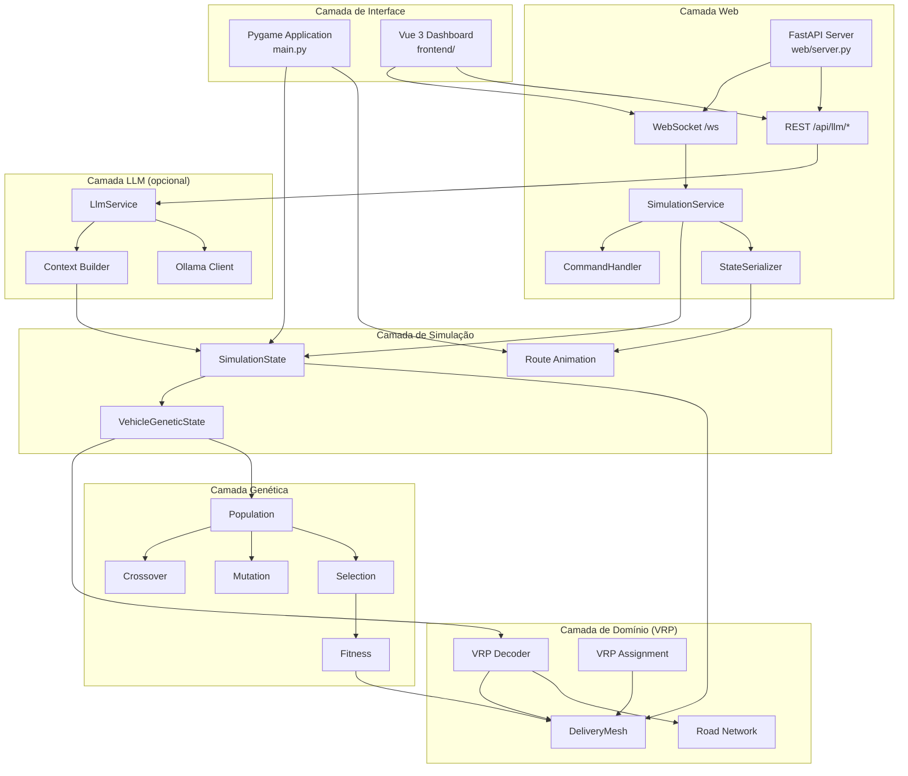
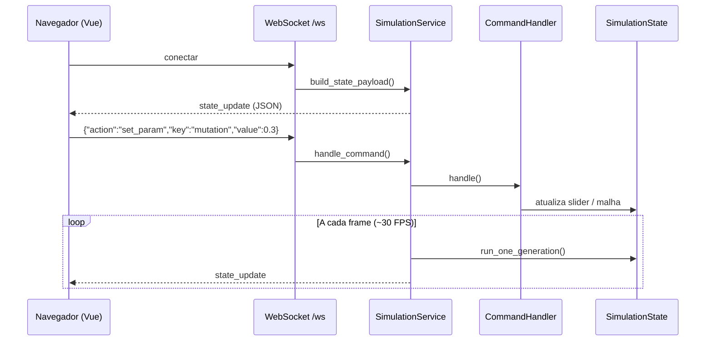
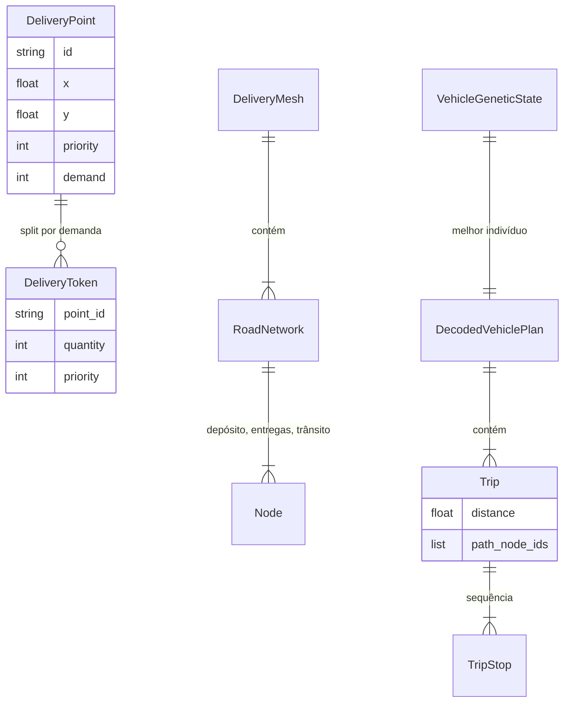
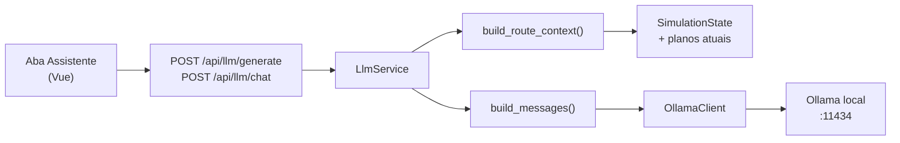

# Arquitetura do Sistema — VRP Hospitalar com Algoritmo Genético

Este documento descreve a arquitetura do projeto para fins acadêmicos: camadas, módulos, fluxos de dados e decisões de design.

---

## Visão geral

O sistema resolve um **Problema de Roteamento de Veículos (VRP)** em cenário hospitalar usando **Algoritmo Genético (AG)**. Duas interfaces compartilham o mesmo núcleo de simulação:

| Interface | Entrada | Tecnologia |
|-----------|---------|------------|
| Desktop | `main.py` | Python + Pygame |
| Web | `web.py` | FastAPI + Vue 3 |

O núcleo (`traveling_salesman_problem/`) é **independente de interface**: a lógica genética, malha de ruas e decodificação VRP não conhecem Pygame nem HTTP.

---

## Diagrama de camadas



---

## Estrutura de pacotes

```
traveling_salesman_problem/
├── config/              # Parâmetros globais (janela, população, tema visual)
├── genetic_algorithm/   # Operadores AG puros (sem UI)
├── problem/             # Modelo VRP: entregas, malha, decoder, prioridades
├── simulation/          # Estado mutável e loop de gerações
├── visualization/       # Renderização Pygame (mapa, widgets, gráficos)
├── web/                 # Adaptador headless para interface Web
└── llm/                 # Assistente LLM via Ollama (modo Web)
```

### Responsabilidades

| Pacote | Responsabilidade | Depende de |
|--------|------------------|------------|
| `config` | Constantes e `ApplicationSettings` | — |
| `genetic_algorithm` | População, fitness, crossover, mutação, seleção | `problem` (malha) |
| `problem` | Entregas, malha de ruas, decoder VRP, presets | — |
| `simulation` | Orquestra gerações, controles, foco de veículos | `genetic_algorithm`, `problem`, `visualization` |
| `visualization` | UI Pygame, mapa, painel de rotas | `simulation`, `problem` |
| `web` | WebSocket, serialização JSON, comandos headless | `simulation` |
| `llm` | Contexto + prompts + Ollama | `web`, `simulation` |

---

## Fluxo de uma geração (Algoritmo Genético)

```mermaid
sequenceDiagram
    participant Loop as Loop Principal
    participant State as SimulationState
    participant VG as VehicleGeneticState
    participant GA as Operadores GA
    participant Dec as VRP Decoder
    participant Mesh as DeliveryMesh

    Loop->>State: run_one_generation()
    loop Para cada veículo
        State->>VG: run_vehicle_generation()
        VG->>GA: seleção de pais
        GA->>GA: crossover (Order Crossover)
        GA->>GA: mutação (troca adjacente)
        GA->>Dec: decode_vehicle_permutation()
        Dec->>Mesh: pathfinding com penalidades
        Dec-->>VG: DecodedVehiclePlan + fitness
        VG->>GA: elitismo + nova população
    end
    VG-->>State: planos, métricas agregadas
    State-->>Loop: geração N, fitness, distância
```

### Representação genética

Cada veículo possui uma **permutação de tokens de entrega** (`DeliveryToken`). O decoder transforma a permutação em viagens respeitando:

- **Capacidade** do veículo (viagens múltiplas com retorno ao depósito)
- **Malha de ruas** (nós de trânsito, bloqueios)
- **Prioridade** das entregas (penalidade por ordem de visita)
- **Penalidade por nós bloqueados** cruzados

---

## Fluxo Web (modo headless)



O frontend envia comandos com `type: "command"` (adicionado pelo composable `useWebSocket`). O backend processa apenas o campo `action`.

---

## Modelo de dados VRP



---

## Integração LLM (Ollama)



O contexto enviado ao modelo é um **JSON compacto** com métricas, entregas, veículos, bloqueios e histórico da sessão. O LLM **não altera** a simulação — apenas gera relatórios e responde perguntas.

---

## Função de fitness

O fitness total de um plano de veículo é:

```
fitness = distância_total
        + peso_prioridade × Σ(prioridade × posição_visita)
        + penalidade_por_nó_bloqueado_cruzado
```

Valores menores indicam soluções melhores (minimização).

---

## Decisões de arquitetura

| Decisão | Motivo |
|---------|--------|
| Núcleo compartilhado Desktop/Web | Evita duplicação; Web é interface alternativa |
| Controles headless (`HeadlessSlider`) | Mesma API de sliders sem Pygame no modo Web |
| Decoder separado do AG | Permutação genética ≠ rota física na malha |
| WebSocket push | Estado da simulação muda a cada frame; polling seria ineficiente |
| LLM opcional via Ollama | Funciona offline; sem custo de API cloud |
| `SessionHistory` leve | Snapshots apenas quando fitness melhora |

---

## Pontos de entrada

| Arquivo | Função |
|---------|--------|
| [`main.py`](../main.py) | Inicia aplicação Pygame |
| [`web.py`](../web.py) | Inicia servidor Uvicorn + FastAPI |
| [`demos/`](../demos/) | Scripts de demonstração isolados |

---

## Documentação relacionada

- [GUIA.md](../GUIA.md) — explicação didática módulo a módulo
- [API.md](API.md) — contrato WebSocket e REST
- [README.md](../README.md) — instalação e execução
