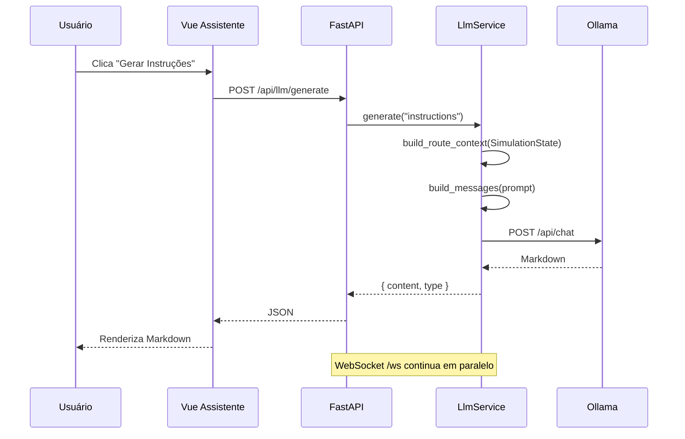

# Design: Integração LLM — Instruções, Relatórios e Chat

**Data:** 2026-07-13  
**Status:** Aprovado — especificação enriquecida  
**Commits:** nenhum até pedido explícito do usuário

**Contexto:** O simulador VRP hospitalar já expõe rotas otimizadas, métricas de convergência, entregas com prioridade e malha de ruas via dashboard Web (FastAPI + Vue). Esta feature adiciona integração com LLM local (Ollama) para gerar instruções operacionais, relatórios e responder perguntas em linguagem natural.

**Depende de:** estado serializado em `traveling_salesman_problem/web/state_serializer.py` e `SimulationService`.

### Pacote de especificação (`.specs/features/llm-integration/`)

| Documento | Conteúdo |
|-----------|----------|
| [spec.md](../../../.specs/features/llm-integration/spec.md) | Requisitos REQ-LLM-XX, user stories, edge cases |
| [context.md](../../../.specs/features/llm-integration/context.md) | Decisões Q1–Q4 do brainstorming |
| [api-contract.md](../../../.specs/features/llm-integration/api-contract.md) | Contrato REST completo |
| [prompts.md](../../../.specs/features/llm-integration/prompts.md) | System prompts e schema JSON |
| [ui-spec.md](../../../.specs/features/llm-integration/ui-spec.md) | Wireframe e componentes Vue |
| [plan.md](../plans/2026-07-13-llm-integration.md) | Plano de implementação |

---

## 1. Objetivo

- Utilizar LLM pré-treinada localmente (Ollama) para:
  - Gerar **instruções detalhadas** para motoristas/equipes com base nas rotas otimizadas (sob demanda);
  - Criar **relatórios diários/semanais** sobre eficiência de rotas, economia de tempo e recursos;
  - **Sugerir melhorias** no processo com base em padrões identificados nos dados da simulação;
  - Responder **perguntas em linguagem natural** sobre rotas e entregas via chat embutido.
- Implementar **prompts eficientes** com contexto compacto (modelo pequeno: `gemma4:e2b`).
- Permitir **exportação** de relatórios em Markdown e PDF.

**Fora do escopo (v1):**

- Integração com Desktop Pygame;
- Persistência em banco de dados (relatórios semanais = agregação da sessão atual);
- Streaming de respostas;
- Agendamento automático de relatórios;
- Geração automática de instruções ao estabilizar fitness.

---

## 2. Decisões validadas

| Tópico | Decisão |
|--------|---------|
| Provedor LLM | Ollama local (`gemma4:e2b`) |
| Interface | Dashboard Web — aba "Assistente" com chat + exportação |
| Relatórios periódicos | Histórico leve em memória na sessão + templates diário/semanal sob demanda |
| Instruções para motoristas | Sob demanda (botão + dropdown de veículo) |
| Arquitetura | Módulo `llm/` + endpoints REST no FastAPI (abordagem A) |
| Comunicação LLM | REST separado do WebSocket (não bloqueia loop de simulação) |
| Idioma dos prompts/respostas | Português |
| Git | Sem commit até pedido explícito |

---

## 3. Arquitetura

```
┌─────────────────────────────────────────────────────────────┐
│  Vue Dashboard                                              │
│  ┌──────────────┐  ┌─────────────────────────────────────┐  │
│  │ TabPanel     │  │ Nova aba "Assistente"               │  │
│  │ (existente)  │  │ • Chat NL                           │  │
│  └──────────────┘  │ • Botões: Instruções / Relatório    │  │
│                    │ • Exportar MD / PDF                   │  │
│                    └──────────────┬──────────────────────┘  │
└───────────────────────────────────┼─────────────────────────┘
                                    │ REST /api/llm/*
┌───────────────────────────────────▼─────────────────────────┐
│  FastAPI (server.py)                                        │
│  ┌─────────────────┐  ┌──────────────┐  ┌────────────────┐  │
│  │ SimulationService│  │ LlmRouter    │  │ SessionHistory │  │
│  │ (existente)      │──│ chat/generate│──│ (in-memory)    │  │
│  └─────────────────┘  └──────┬───────┘  └────────────────┘  │
└────────────────────────────────┼──────────────────────────────┘
                                 │
                    ┌────────────▼────────────┐
                    │  llm/                     │
                    │  • OllamaClient           │
                    │  • RouteContextBuilder    │
                    │  • PromptTemplates        │
                    └────────────┬────────────┘
                                 │ HTTP localhost:11434
                    ┌────────────▼────────────┐
                    │  Ollama (gemma4:e2b)      │
                    └───────────────────────────┘
```

**Princípios:**

- LLM roda **somente no backend** — frontend nunca fala com Ollama diretamente.
- `SimulationService` continua dono do estado; `LlmService` recebe referência para montar contexto.
- WebSocket existente **não muda**.

---

## 4. Backend

### 4.1 Pacote `traveling_salesman_problem/llm/`

| Módulo | Responsabilidade |
|--------|------------------|
| `ollama_client.py` | Cliente HTTP async para Ollama |
| `context_builder.py` | Monta contexto compacto a partir de `SimulationState` + plans |
| `prompts.py` | Templates de system/user prompt por tipo de geração |
| `session_history.py` | Snapshots leves em memória durante a sessão |
| `service.py` | Orquestra: contexto → prompt → Ollama → resposta |

### 4.2 `OllamaClient`

Configuração via variáveis de ambiente:

| Variável | Default |
|----------|---------|
| `OLLAMA_BASE_URL` | `http://127.0.0.1:11434` |
| `OLLAMA_MODEL` | `gemma4:e2b` |
| `OLLAMA_TIMEOUT` | `120` |
| `LLM_MAX_CONTEXT_TOKENS` | `2000` |

- Usa `httpx` (async).
- Endpoint: `POST /api/chat` (multi-turn).
- Sem streaming na v1.
- `health_check()` → `GET /api/tags` para validar modelo disponível.

### 4.3 `RouteContextBuilder`

Monta JSON textual compacto para o prompt:

```json
{
  "cenario": "hospitalar",
  "geracao": 142,
  "metricas": { "fitness": 1842, "distancia": 1203.5, "prioridade_pct": 85 },
  "deposito": [120, 340],
  "entregas": [
    { "id": "A", "prioridade": 9, "demanda": 3, "coords": [200, 410] }
  ],
  "veiculos": [
    {
      "id": 0, "distancia": 450.2, "carga": 8, "capacidade": 10,
      "viagens": [{ "paradas": ["D", "A", "C", "D"], "carga": 5 }]
    }
  ],
  "bloqueios": 2,
  "tendencia": { "melhoria_fitness": -12.3, "geracoes_desde_melhoria": 8 }
}
```

- Reutiliza dados de `serialize_state` / `DecodedVehiclePlan`.
- `tendencia` vem do `SessionHistory`.
- Limite estimado: ~2000 tokens de contexto.

### 4.4 `PromptTemplates`

Cinco templates em português:

| Tipo | Trigger | System prompt (resumo) |
|------|---------|------------------------|
| `instructions` | Botão "Gerar instruções" | Coordenador de logística hospitalar; instruções passo a passo por veículo |
| `daily_report` | Botão "Relatório diário" | Relatório operacional com métricas, destaques e alertas |
| `weekly_report` | Botão "Relatório semanal" | Consolida snapshots da sessão em relatório de eficiência |
| `improvements` | Botão "Sugestões" | Analisa padrões e sugere melhorias no processo |
| `chat` | Input do usuário | Responde usando APENAS dados do contexto; admite incerteza |

Parâmetros:

- `instructions`: `vehicle_id` opcional (`null` = todos os veículos).
- Formato de saída pedido à LLM: **Markdown estruturado**.

### 4.5 `SessionHistory`

```python
@dataclass
class Snapshot:
    timestamp: float
    generation: int
    fitness: float
    distance: float
    priority_served_pct: int
    blocked_nodes: int
    vehicle_count: int

class SessionHistory:
    max_entries: int = 500
```

- Integrado ao `SimulationService.run_loop` — registra snapshot quando `total_fitness` melhora.
- Relatório "semanal" = agregação de todos os snapshots da sessão (não calendário real).
- Relatório "diário" = snapshot atual + últimas melhorias registradas.

### 4.6 Endpoints REST

| Método | Rota | Body | Resposta |
|--------|------|------|----------|
| `GET` | `/api/llm/health` | — | `{ "ok": true, "model": "gemma4:e2b" }` |
| `POST` | `/api/llm/generate` | `{ "type": "instructions", "vehicle_id": 0 }` | `{ "content": "# Instruções...", "type": "instructions" }` |
| `POST` | `/api/llm/chat` | `{ "message": "...", "history": [...] }` | `{ "reply": "...", "history": [...] }` |
| `POST` | `/api/llm/export` | `{ "content": "...", "format": "md" \| "pdf" }` | arquivo para download |

Tratamento de erros:

- Ollama offline → `503` com mensagem: *"Ollama não está rodando. Execute: ollama serve"*
- Timeout → `504`
- Modelo ausente → `503` com orientação `ollama pull`

### 4.7 Exportação PDF

1. **Markdown**: retorna `.md` direto.
2. **PDF**: backend converte MD → HTML → PDF com `markdown` + `weasyprint` (opcional em `requirements-llm.txt`).
3. **Fallback**: se WeasyPrint indisponível no Windows, frontend usa `window.print()` com CSS de impressão.

### 4.8 Arquivos novos/alterados (backend)

```
traveling_salesman_problem/
├── llm/
│   ├── __init__.py
│   ├── ollama_client.py
│   ├── context_builder.py
│   ├── prompts.py
│   ├── session_history.py
│   └── service.py
└── web/
    ├── llm_routes.py          ← novo router FastAPI
    ├── server.py              ← registra router + injeta service
    └── simulation_service.py  ← integra SessionHistory
```

---

## 5. Frontend

### 5.1 Nova aba no `TabPanel`

Adicionar tab `{ id: "assistente", label: "Assistente" }` ao `TabPanel.vue`.

### 5.2 Layout do painel (`LlmAssistantPanel.vue`)

```
┌─────────────────────────────────────┐
│ Status: ● Ollama conectado          │
├─────────────────────────────────────┤
│ [Instruções ▾] [Rel. Diário]        │
│ [Rel. Semanal] [Sugestões]          │
├─────────────────────────────────────┤
│ Área de resposta (Markdown)         │
│ [Exportar MD] [Exportar PDF]        │
├─────────────────────────────────────┤
│ Chat (histórico + input)            │
└─────────────────────────────────────┘
```

### 5.3 Componentes

| Componente | Responsabilidade |
|------------|------------------|
| `LlmAssistantPanel.vue` | Container principal da aba |
| `LlmActionBar.vue` | Botões de geração + dropdown de veículo |
| `LlmOutputViewer.vue` | Renderiza Markdown da última resposta |
| `LlmChatBox.vue` | Histórico de chat + input |
| `useLlmApi.ts` | Composable REST para `/api/llm/*` |

### 5.4 `useLlmApi.ts`

```typescript
const API_BASE = import.meta.env.DEV
  ? "http://127.0.0.1:8000"
  : "";
```

Funções: `health()`, `generate(type, vehicleId?)`, `chat(message, history)`, `export(content, format)`.

Estado reativo: `loading`, `error`, `lastOutput`, `chatHistory`, `ollamaStatus`.

### 5.5 Estados de UI

| Estado | Comportamento |
|--------|---------------|
| Ollama offline | Badge vermelho + banner com instruções |
| Gerando | Spinner no botão ativo; demais ações desabilitadas |
| Erro 504 | Mensagem de timeout |
| Sem rotas | Botões desabilitados até `state.plans` ter dados |

### 5.6 Dependência frontend

- `marked` — renderização Markdown com estilos alinhados ao tema claro/escuro.

### 5.7 Arquivos novos/alterados (frontend)

```
frontend/src/
├── components/
│   ├── LlmAssistantPanel.vue
│   ├── LlmActionBar.vue
│   ├── LlmOutputViewer.vue
│   ├── LlmChatBox.vue
│   └── TabPanel.vue              ← nova aba
└── composables/
    └── useLlmApi.ts
```

---

## 6. Testes

| Arquivo | O que testa | Mock? |
|---------|-------------|-------|
| `tests/test_context_builder.py` | JSON compacto a partir de `SimulationState` | Não |
| `tests/test_prompts.py` | Templates com campos obrigatórios | Não |
| `tests/test_session_history.py` | Snapshots, agregação, limite | Não |
| `tests/test_ollama_client.py` | Parsing e erros | Mock `httpx` |
| `tests/test_llm_service.py` | Orquestração generate/chat | Mock client |
| `tests/test_llm_routes.py` | Endpoints REST | Mock service |

Testes CI não dependem de Ollama instalado.

---

## 7. Dependências novas

**Python** (`requirements.txt`):

```
httpx>=0.27.0
markdown>=3.5.0
```

**Opcional** (`requirements-llm.txt`):

```
weasyprint>=62.0
```

**Frontend** (`package.json`):

```
marked
```

**Configuração:** `.env.example` na raiz com variáveis `OLLAMA_*` e `LLM_*`.

---

## 8. Limitações conhecidas (v1)

| Limitação | Mitigação |
|-----------|-----------|
| Modelo 2B pode alucinar números | Prompt exige uso exclusivo do contexto; aviso no painel |
| Sem persistência entre sessões | Relatório semanal = agregação da sessão atual |
| Latência 10–60s por resposta | Spinner + timeout configurável |
| Nome `gemma4:e2b` pode não existir no Ollama | Health check + mensagem `ollama pull` |
| Chat sem streaming | Resposta completa de uma vez; streaming em v2 |
| Desktop Pygame fora do escopo | Apenas dashboard Web |

---

## 9. Critérios de aceite

1. Com Ollama rodando e modelo disponível, **"Gerar instruções"** produz Markdown com passos por veículo.
2. **Relatório diário** inclui métricas atuais (fitness, distância, prioridade).
3. **Relatório semanal** agrega snapshots da sessão.
4. **Sugestões** retorna lista de melhorias baseadas nos dados.
5. Chat responde perguntas como *"qual veículo tem mais entregas críticas?"* usando dados reais.
6. Export MD funciona; PDF funciona (backend ou fallback print).
7. Com Ollama offline, UI mostra erro claro sem quebrar a simulação.
8. Testes pytest passam sem Ollama instalado.

---

## 10. Fluxo de dados (sequência)



## 11. Dados disponíveis para contexto

Fontes no código existente reutilizadas pelo `RouteContextBuilder`:

| Dado | Fonte no código |
|------|-----------------|
| Entregas (id, prioridade, demanda, coords) | `SimulationState.deliveries` |
| Depósito | `SimulationState.depot` |
| Planos por veículo (viagens, paradas, carga) | `DecodedVehiclePlan` via `SimulationService.plans` |
| Métricas agregadas | `SimulationService.total_fitness/distance/priority` |
| % críticos atendidos cedo | `_priority_served_pct()` em `state_serializer.py` |
| Nós bloqueados | `SimulationState.mesh.blocked_ids` |
| Histórico de melhorias | `SessionHistory` (novo) |
| Tendência de convergência | `SessionHistory.trend()` |

## 12. Abordagens consideradas e rejeitadas

| Abordagem | Motivo da rejeição |
|-----------|-------------------|
| B — tudo em `web/llm_service.py` | Menos testável; mistura orquestração com prompts |
| C — frontend chama Ollama | CORS, contexto incompleto, expõe modelo no browser |
| OpenAI/Azure (Q1-A/B) | Decisão do usuário: local/offline |
| Auto-gerar ao convergir (Q4-B/C) | Decisão do usuário: sob demanda |
| Persistência SQLite (Q3-B) | Decisão do usuário: memória de sessão |

## 13. Próximo passo

Especificação completa em `.specs/features/llm-integration/`. Implementar conforme [plan.md](../plans/2026-07-13-llm-integration.md).
